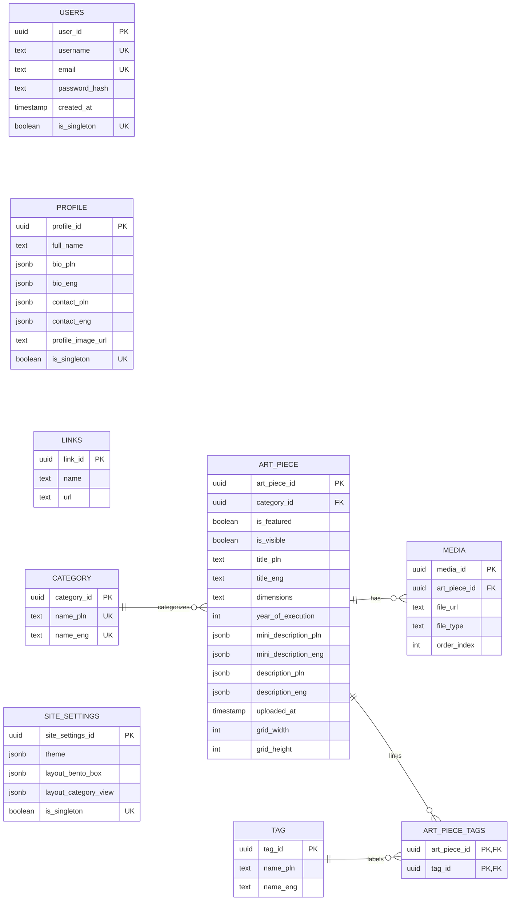

```mermaid
---
references:
  - "File: /db/schema.ts"
generationTime: 2026-08-10T19:11:13.147Z
---
erDiagram
    direction LR

    USERS {
        uuid user_id PK
        text username UK
        text email UK
        text password_hash
        timestamp created_at
        boolean is_singleton UK
    }

    PROFILE {
        uuid profile_id PK
        text full_name
        jsonb bio_pln
        jsonb bio_eng
        jsonb contact_pln
        jsonb contact_eng
        text profile_image_url
        boolean is_singleton UK
    }

    LINKS {
        uuid link_id PK
        text name
        text url
    }

    CATEGORY {
        uuid category_id PK
        text name_pln UK
        text name_eng UK
    }

    TAG {
        uuid tag_id PK
        text name_pln
        text name_eng
    }

    ART_PIECE {
        uuid art_piece_id PK
        uuid category_id FK
        boolean is_featured
        boolean is_visible
        text title_pln
        text title_eng
        text dimensions
        int year_of_execution
        jsonb mini_description_pln
        jsonb mini_description_eng
        jsonb description_pln
        jsonb description_eng
        timestamp uploaded_at
        int grid_width
        int grid_height
    }

    MEDIA {
        uuid media_id PK
        uuid art_piece_id FK
        text file_url
        text file_type
        int order_index
    }

    ART_PIECE_TAGS {
        uuid art_piece_id PK, FK
        uuid tag_id PK, FK
    }

    SITE_SETTINGS {
        uuid site_settings_id PK
        jsonb theme
        jsonb layout_bento_box
        jsonb layout_category_view
        boolean is_singleton UK
    }

    CATEGORY ||--o{ ART_PIECE : categorizes
    ART_PIECE ||--o{ MEDIA : has
    ART_PIECE ||--o{ ART_PIECE_TAGS : links
    TAG ||--o{ ART_PIECE_TAGS : labels
```