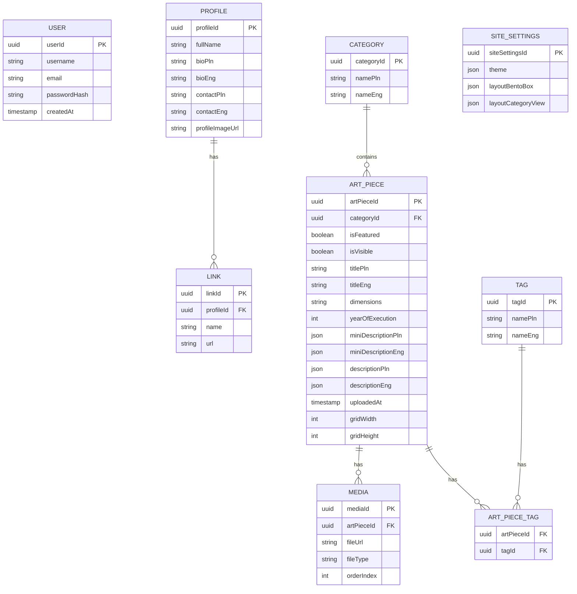

```mermaid
erDiagram
    USER {
        uuid userId PK
        string username
        string email
        string passwordHash
        timestamp createdAt
    }

    PROFILE {
        uuid profileId PK
        string fullName
        string bioPln
        string bioEng
        string contactPln
        string contactEng
        string profileImageUrl
    }

    LINK {
        uuid linkId PK
        uuid profileId FK
        string name
        string url
    }

    CATEGORY {
        uuid categoryId PK
        string namePln
        string nameEng
    }

    TAG {
        uuid tagId PK
        string namePln
        string nameEng
    }

    ART_PIECE {
        uuid artPieceId PK
        uuid categoryId FK
        boolean isFeatured
        boolean isVisible
        string titlePln
        string titleEng
        string dimensions
        int yearOfExecution
        json miniDescriptionPln
        json miniDescriptionEng
        json descriptionPln
        json descriptionEng
        timestamp uploadedAt
        int gridWidth
        int gridHeight
    }

    MEDIA {
        uuid mediaId PK
        uuid artPieceId FK
        string fileUrl
        string fileType
        int orderIndex
    }

    ART_PIECE_TAG {
        uuid artPieceId FK
        uuid tagId FK
    }

    SITE_SETTINGS {
        uuid siteSettingsId PK
        json theme
        json layoutBentoBox
        json layoutCategoryView
    }

    PROFILE ||--o{ LINK : has
    CATEGORY ||--o{ ART_PIECE : contains
    ART_PIECE ||--o{ MEDIA : has
    ART_PIECE ||--o{ ART_PIECE_TAG : has
    TAG ||--o{ ART_PIECE_TAG : has
```