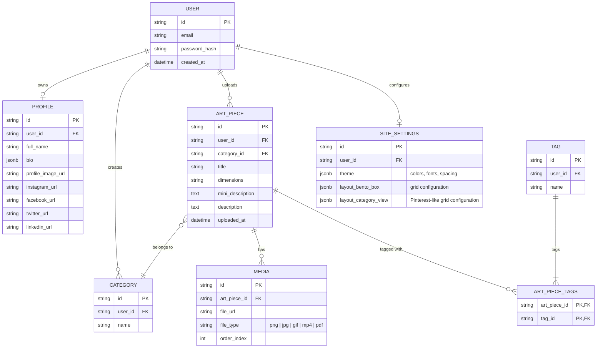

## Database Project

### ERD diagram

### Table Descriptions
- **USER**: Stores user account information including email and password hash.
- **PROFILE**: Contains user profile details such as full name, bio, profile image, and social media links.
- **CATEGORY**: Represents categories created by users to organize their art pieces.
- **ART_PIECE**: Stores information about individual art pieces uploaded by users.
- **MEDIA**: Contains media files associated with art pieces, including images and videos.
- **TAG**: Represents tags created by users to categorize their art pieces.
- **ART_PIECE_TAGS**: A join table to associate art pieces with multiple tags.
- **SITE_SETTINGS**: Stores user-specific site settings such as theme and layout configurations.
- **Relationships**:
  - A user can have one profile, multiple categories, and multiple art pieces.
  - An art piece belongs to one category and can have multiple media files and tags.
  - A tag can be associated with multiple art pieces through the ART_PIECE_TAGS join table.
