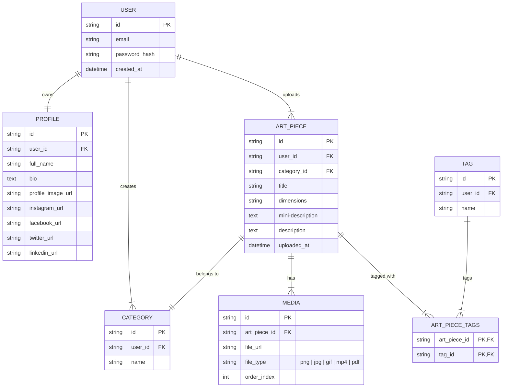

## Database Project

```mermaid
erDiagram
    USER {
        string id PK
        string email
        string password_hash
        datetime created_at
    }

    PROFILE {
        string id PK
        string user_id FK
        string full_name
        text bio 
        string profile_image_url
        string instagram_url
        string facebook_url
        string twitter_url
        string linkedin_url
    }

    CATEGORY {
        string id PK
        string user_id FK
        string name 
    }

    ART_PIECE {
        string id PK
        string user_id FK
        string category_id FK
        string title
        string dimensions
        text mini-description
        text description
        datetime uploaded_at
    }

    MEDIA {
        string id PK
        string art_piece_id FK
        string file_url
        string file_type "png | jpg | gif | mp4 | pdf"
        int order_index 
    }

    TAG {
        string id PK
        string user_id FK
        string name 
    }

    ART_PIECE_TAGS {
        string art_piece_id PK, FK
        string tag_id PK, FK
    }

    USER ||--|| PROFILE : "owns"
    USER ||--|{ CATEGORY : "creates"
    USER ||--|{ ART_PIECE : "uploads"
    ART_PIECE ||--|| CATEGORY : "belongs to"
    ART_PIECE ||--|{ MEDIA : "has"
    ART_PIECE ||--|{ ART_PIECE_TAGS : "tagged with"
    TAG ||--|{ ART_PIECE_TAGS : "tags"

```