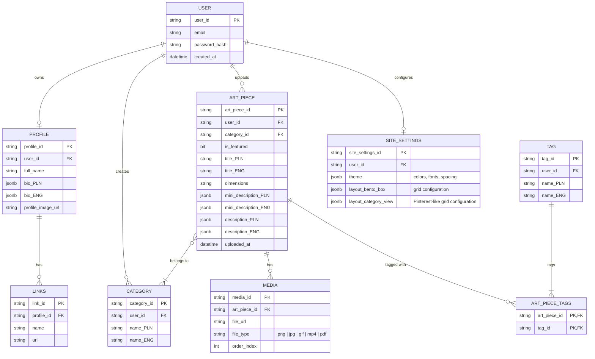

## Database Project

### ERD diagram

```mermaid
erDiagram
    USER {
        string user_id PK
        string email
        string password_hash
        datetime created_at
    }

    PROFILE {
        string profile_id PK
        string user_id FK
        string full_name
        jsonb bio_PLN
        jsonb bio_ENG
        string profile_image_url
    }

    LINKS {
        string link_id PK
        string profile_id FK
        string name
        string url
    }
    
    CATEGORY {
        string category_id PK
        string user_id FK
        string name_PLN
        string name_ENG 
    }

    ART_PIECE {
        string art_piece_id PK
        string user_id FK
        string category_id FK
        bit is_featured
        string title_PLN
        string title_ENG
        string dimensions
        jsonb mini_description_PLN
        jsonb mini_description_ENG
        jsonb description_PLN
        jsonb description_ENG
        datetime uploaded_at
    }

    MEDIA {
        string media_id PK
        string art_piece_id FK
        string file_url
        string file_type "png | jpg | gif | mp4 | pdf"
        int order_index 
    }

    TAG {
        string tag_id PK
        string user_id FK
        string name_PLN
        string name_ENG
    }

    ART_PIECE_TAGS {
        string art_piece_id PK, FK
        string tag_id PK, FK
    }

    SITE_SETTINGS {
        string site_settings_id PK
        string user_id FK
        jsonb theme "colors, fonts, spacing"
        jsonb layout_bento_box "grid configuration"
        jsonb layout_category_view "Pinterest-like grid configuration"
    }

    USER ||--o| PROFILE : "owns"
    USER ||--o{ CATEGORY : "creates"
    USER ||--o{ ART_PIECE : "uploads"
    ART_PIECE }o--|{ CATEGORY : "belongs to"
    ART_PIECE ||--o{ MEDIA : "has"
    ART_PIECE ||--o{ ART_PIECE_TAGS : "tagged with"
    TAG ||--|{ ART_PIECE_TAGS : "tags"
    USER ||--o| SITE_SETTINGS : "configures"
    PROFILE ||--o{ LINKS : "has"
```

### Table Descriptions
- **USER**: Stores user account information including email and password hash.
- **PROFILE**: Contains user profile details such as full name, bio, profile image, and social media links.
- **CATEGORY**: Represents categories created by users to organize their art pieces.
- **ART_PIECE**: Stores information about individual art pieces uploaded by users.
- **MEDIA**: Contains media files associated with art pieces, including images and videos.
- **TAG**: Represents tags created by users to categorize their art pieces.
- **ART_PIECE_TAGS**: A join table to associate art pieces with multiple tags.
- **SITE_SETTINGS**: Stores user-specific site settings such as theme and layout configurations.
- **Relationships**:
  - A user can have one profile, multiple categories, and multiple art pieces.
  - An art piece belongs to one category and can have multiple media files and tags.
  - A tag can be associated with multiple art pieces through the ART_PIECE_TAGS join table.

### Typescript
```typescript
export interface RichTextContent {
    content: Record<string, unknown>; // Rich text data from editor
}

export interface User {
    user_id: string;
    email: string;
    password_hash: string;
    created_at: Date;
}

export interface Profile {
    profile_id: string;
    user_id: string; // FK to User
    full_name: string;
    bio_PLN: RichTextContent;
    bio_ENG: RichTextContent;
    profile_image_url: string;
}

export interface Links {
    link_id: string;
    profile_id: string; // FK to Profile
    name: string;
    url: string;
}

export interface Category {
    category_id: string;
    user_id: string; // FK to User
    name_PLN: string;
    name_ENG: string;
}

export interface ArtPiece {
    art_piece_id: string;
    user_id: string; // FK to User
    category_id: string; // FK to Category
    is_featured: boolean;
    title_PLN: string;
    title_ENG: string;
    dimensions: string;
    mini_description_PLN: RichTextContent;
    mini_description_ENG: RichTextContent;
    description_PLN: RichTextContent;
    description_ENG: RichTextContent;
    uploaded_at: Date;
    grid_width: number; // 1-5 (bento box width in columns)
    grid_height: number; // 1-5 (bento box height in rows)
}

export interface Media {
    media_id: string;
    art_piece_id: string; // FK to ArtPiece
    file_url: string;
    file_type: "png" | "jpg" | "gif" | "mp4" | "pdf";
    order_index: number;
}

export interface Tag {
    tag_id: string;
    user_id: string; // FK to User
    name_PLN: string;
    name_ENG: string;
}

export interface ArtPieceTags {
    art_piece_id: string; // PK, FK to ArtPiece
    tag_id: string; // PK, FK to Tag
}

export interface SiteSettings {
    site_settings_id: string;
    user_id: string; // FK to User
    theme: ThemeConfig;
    layout_bento_box: BentoBoxLayout;
    layout_category_view: CategoryViewLayout;
}

export interface ThemeConfig {
    colors: Record<string, string>;
    fonts: Record<string, string>;
    spacing: Record<string, string>;
}

export interface BentoBoxLayout {
    columns: number; // e.g., 5 columns total grid
    rows: number; // e.g., 5 rows total grid
}

export interface CategoryViewLayout {
    columns: number; // e.g., 3 columns (fixed), rows auto-calculate
}
```