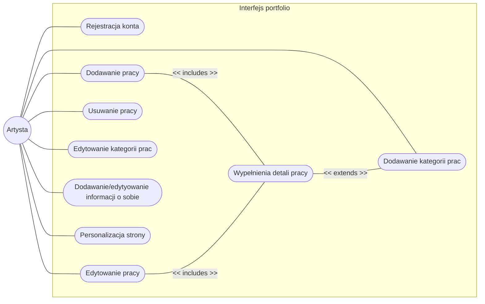
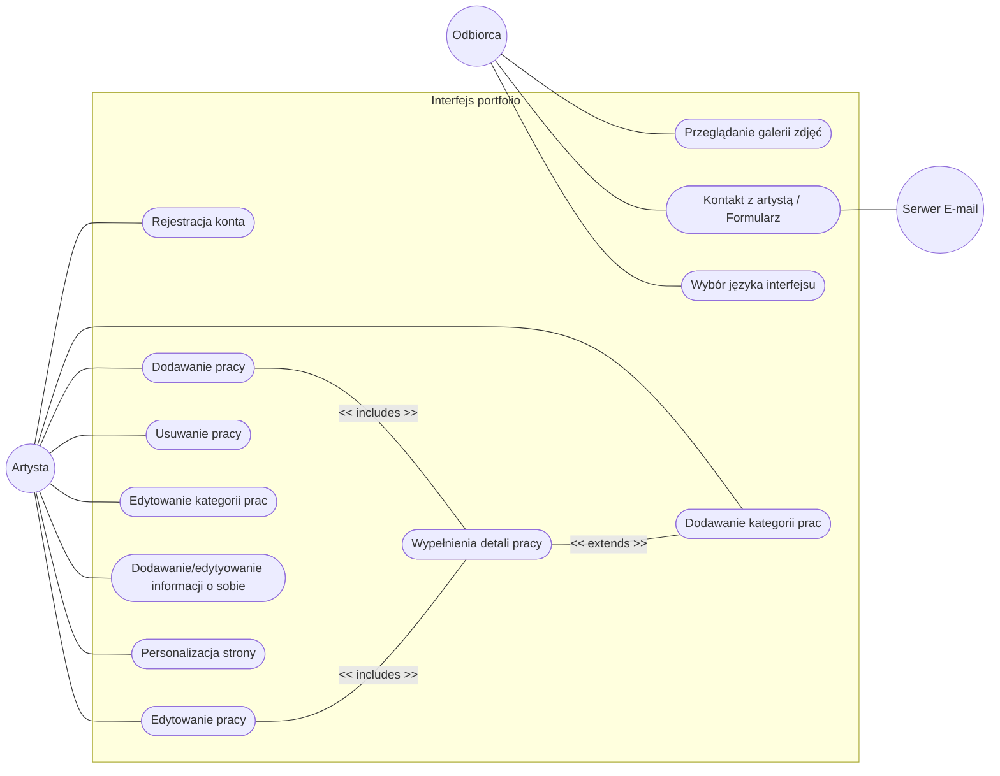

# Przypadki użycia Portfolio Artysty

## Przypadki użycia dla Odbiorcy

## Przypadki użycia dla Artysty

<!--

-->

## Specyfikacja przypadków użycia

### PU1 - Przeglądanie galerii zdjęć
| **Nazwa** | Przeglądanie galerii zdjęć | 
| :--- | :--- |
| **Warunki wstępne** | Artysta udostępnił publicznie swoje portfolio w systemie ArtSea. |
| **Podstawowy scenariusz interakcji** | 1. Odbiorca wchodzi na podstrona galerii artysty. 2. System ładuje układ strony i wyświetla miniatury prac. 3. Odbiorca wybiera (klika) interesującą go miniaturę.  4. System wyświetla powiększone zdjęcie w wysokiej rozdzielczości wraz tytułem, opisem, użytymi technikami itd.  5. Odbiorca zamyka podgląd powiększonego zdjęcia.  6. System powraca do widoku głównej galerii, zachowując pozycję przewijania.|
| **Wyjątki i scenariusze alternatywne** | **Filtrowanie po kategorii:** 3a1. Odbiorca przed kliknięciem wybiera z menu konkretną kategorię prac (np. rzeźba) 3a2.System odświeża siatkę, pokazując wyłącznie miniatury z wybranej kategorii.    **Brak Prac:**  2a. Portfolio jest puste. System wyświetla wiadomość typu: "Artysta nie dodał jeszcze żadnych prac. Zajrzyj tu wkrótce!" |
| **Warunki końcowe** | Odbiorca pomyślnie obejrzał wybrane prace w portfolio. |
| **Komentarze** | --- |
  

### PU2 - Kontakt z artystą / Formularz
| **Nazwa** | Kontakt z artystą / Formularz |
| :--- | :--- |
| **Warunki wstępne** | Odbiorca znajduje się w portfolio artysty. Artysta włączył opcję formularza kontaktowego w ustawieniach systemu. |
| **Podstawowy scenariusz interakcji** | 1. Odbiorca przechodzi do sekcji kontaktowej na stronie 2. System wyświetla formularz kontaktowy z polami: Imię i Nazwisko, Adres e-mail (zwrotny), Temat, Treść wiadomości. 3. Odbiorca wypełnia wszystkie wymagane pola.  4.  Odbiorca klika przycisk "Wyślij wiadomość".  5. System waliduje poprawność wprowadzonych danych.   6. System przekazuje wiadomość do zewnętrznego serwera E-mail  7. System wyświetla komunikat o sukcesie i czyści Formularz.|
| **Wyjątki i scenariusze alternatywne** | **Zachowanie stanu przy utracie sesji:** 3a. Jeśli Odbiorca na chwilę straci połączenie z internetem w trakcie pisania, system zachowuje wpisaną treść w pamięci lokalnej przeglądarki, zapobiegając utracie tekstu.   **Błąd walidacji danych:** 5a. Odbiorca wprowadził niepoprawny format adresu e-mail (np. brak znaku @) lub zostawił puste pole obowiązkowe. System nie wysyła wiadomości, podświetla błędne pola na czerwono i wyświetla komunikat: "Popraw błędy w formularzu przed wysłaniem".  **Błąd serwera:**  6a. Serwer napotyka błąd podczas próby wysłania wiadomości (np. problem z usługą e-mail). System wyświetla komunikat: "Wystąpił problem techniczny. Nie udało się wysłać wiadomości. Spróbuj ponownie później." Tekst wpisany przez użytkownika nie jest usuwany.
| **Warunki końcowe** | Wiadomość od Odbiorcy zostaje pomyślnie przekazana do wysyłki na adres e-mail Artysty. |
| **Komentarze** | --- |
  

<!-- tylko polski i angielski -->
### PU3 - Wybór języka
| **Nazwa** | Wybór języka|
| :--- | :--- |
| **Warunki wstępne** | Odbiorca znajduje się w portfolio. System ma zaimplementowaną obsługę więcej niż jednego języka. Podstawowo strona wyświetla się w języku przeglądarki. |
| **Podstawowy scenariusz interakcji** | 1. Odbiorca lokalizuje przycisk wyboru języka. 2. Odbiorca klika przycisk wyboru języka. 3. System wyświetla listę dostępnych języków.  4. Odbiorca klika preferowany język.  5. System przeładowuje stronę na wybrany język. |
| **Wyjątki i scenariusze alternatywne** | **Brak tłumaczeń niektórych treści autorskich:** 5a. Interfejs platformy zmienia się na wybrany język, ale opisy zdjęć i biogram wprowadzone manualnie przez artystę pozostają w języku oryginalnym. System może opcjonalnie wyświetlić komunikat "Treści autorskie mogą nie być dostępne w wybranym języku".|
| **Warunki końcowe** | Interfejs prezentowany jest w wybranym języku. |
| **Komentarze** | --- |

## Przypadki użycia dla Artysty

### PU4 - Rejestracja konta
| **Nazwa** | Rejestracja konta |
| :--- | :--- |
| **Warunki wstępne** | Artysta nie posiada jeszcze konta w systemie ArtSea. |
| **Podstawowy scenariusz interakcji** | 1. Artysta klika przycisk "Rejestracja" na stronie głównej platformy.  2. System wyświetla formularz rejestracji z polami: Adres e-mail, Hasło, Potwierdzenie hasła.  3. Artysta wypełnia wszystkie wymagane pola. 4. Artysta klika przycisk "Utwórz konto". 5. System waliduje dane wejściowe.  6. System wysyła wiadomość potwierdzającą na adres e-mail artysty. 7. System wyświetla komunikat: "Sprawdź swoją skrzynkę e-mailową, aby potwierdzić konto". 8. Artysta klika link potwierdzający w wiadomości e-mail.  9. System aktywuje konto i kieruje artystę na panel edycji portfolio. |
| **Wyjątki i scenariusze alternatywne** | **Błąd walidacji danych:** 5a. Adres e-mail jest już zarejestrowany, hasło jest zbyt słabe lub format danych jest nieprawidłowy. System podświetla błędne pola i wyświetla odpowiedni komunikat.    **Brak potwierdzenia e-mail:**   6a. Link potwierdzający wygasa po 60 minutach. System wyświetla opcję wysłania nowego linku potwierdzającego. |
| **Warunki końcowe** | Konto artysty zostaje pomyślnie utworzone i aktywowane. Artysta może zalogować się i przystąpić do konfiguracji profilu. |
| **Komentarze** | Wymagania bezpieczeństwa dla hasła: minimum 8 znaków, co najmniej jedno duże litery, cyfra i znak specjalny. |
  

### PU5 - Dodawanie pracy
| **Nazwa** | Dodawanie pracy |
| :--- | :--- |
| **Warunki wstępne** | Artysta jest zalogowany w panelu edycji portfolio. |
| **Podstawowy scenariusz interakcji** | 1. Artysta przechodzi do sekcji "Moje Prace". 2. System wyświetla listę istniejących prac z przyciskiem "Dodaj pracę". 3. Artysta klika przycisk "Dodaj pracę". 4. System otwiera formularz do wypełniania detali pracy ([Wypełnianie detali pracy](#pu7---wypełnianie-detali-pracy) - PU7). |
| **Wyjątki i scenariusze alternatywne** | --- |
| **Warunki końcowe** | Artysta przechodzi do formularza [PU7](#pu7---wypełnianie-detali-pracy) w celu wypełniania informacji o nowej pracy. |
| **Komentarze** | --- |
  

### PU6 - Edytowanie pracy
| **Nazwa** | Edytowanie pracy |
| :--- | :--- |
| **Warunki wstępne** | Artysta jest zalogowany w panelu edycji portfolio. Posiada co najmniej jedną pracę w portfolio. |
| **Podstawowy scenariusz interakcji** | 1. Artysta przechodzi do sekcji "Moje Prace". 2. System wyświetla listę prac artysty. 3. Artysta najeżdża kursorem na pracę, którą chce edytować.  4. Artysta klika przycisk "Edytuj".  5. System otwiera formularz do edytowania detali pracy (patrz [Wypełnianie detali pracy](#pu7---wypełnianie-detali-pracy) - PU7). |
| **Wyjątki i scenariusze alternatywne** | --- |
| **Warunki końcowe** | Artysta przechodzi do formularza [PU7](#pu7---wypełnianie-detali-pracy) w celu edytowania informacji o pracy. |
| **Komentarze** | --- |
  
<!-- wiele zdjec + zdjecie wiodace (np kolejnosc - priorytet), mozliwosc wpisywania w dwoch jezykach -->
### PU7 - Wypełnianie detali pracy
| **Nazwa** | Wypełnianie detali pracy |
| :--- | :--- |
| **Warunki wstępne** | Artysta przechodzi z przypadku [PU5 - Dodawanie pracy](#pu5---dodawanie-pracy) lub [PU6 - Edytowanie pracy](#pu6---edytowanie-pracy). System wyświetla formularz do wypełniania/edytowania pracy. |
| **Podstawowy scenariusz interakcji** | 1. System wyświetla formularz do dodawania/edytowania pracy ze wszystkimi polami:    - Zdjęcie/Obraz (wymagane) - drag-and-drop lub selektor    - Tytuł (wymagane) - pole tekstowe    - Kategoria (wymagane) - lista rozwijalna    - Opis pracy (opcjonalnie) - pole tekstowe z formatowaniem      - Wymiary (opcjonalnie) - wysokość × szerokość × głębokość (cm)   - Rok wykonania (opcjonalnie) - pole daty/liczby  - Widoczność - checkbox  2. Artysta wypełnia wymagane pola (zdjęcie, tytuł, kategoria) i opcjonalne pola, które chce dodać.  3. Artysta klika przycisk "Zapisz". 4. System waliduje dane (sprawdza obowiązkowe pola, format zdjęcia). 5. System przesyła obraz na serwer, zapisuje dane w bazie danych i wyświetla komunikat o sukcesie. |
| **Wyjątki i scenariusze alternatywne** | **Tworzenie nowej kategorii:** 1a. Jeśli wymagana kategoria nie istnieje, artysta może wybrać "Nowa kategoria" z listy, co otwiera ([patrz PU9](#pu9---dodawanie-kategorii-prac)), po czym powraca do formularza pracy z nową kategorią wybraną.  **Brak połączenia internetowego:** 2a. Jeśli połączenie zostanie przerwane, system przechowuje dane w pamięci lokalnej przeglądarki i automatycznie synchronizuje po przywróceniu połączenia. Wyświetla komunikat "Pracujesz w trybie offline - zmiany zostaną wysłane".  **Anulowanie:** 2b. Artysta klika przycisk "Anuluj". W trybie dodawania - powraca do listy prac bez zapisania. W trybie edytowania - System pyta o potwierdzenie ("Jeśli wyjdziesz, niezapisane zmiany zostaną utracone") i powraca do listy prac bez zmian.   **Błąd walidacji:** 4a. Podczas walidacji: plik je zbyt duży, format nie obsługiwany lub pole obowiązkowe jest puste. System wyświetla komunikat z wymogami i wyróżnia błędne pola, umożliwiając poprawę danych.  |
| **Warunki końcowe** | W trybie dodawania: Nowa praca zostaje dodana do galerii artysty ze wszystkimi wypełnionymi informacjami. Praca jest widoczna dla odbiorców. W trybie edytowania: Zmiany w pracy są zapisywane. Aktualizowana praca jest natychmiast widoczna dla odbiorców. |
| **Komentarze** | Formularz jest uniwersalny - używany zarówno do dodawania (PU5) jak i edytowania (PU6). |
  

### PU8 - Usuwanie pracy
| **Nazwa** | Usuwanie pracy |
| :--- | :--- |
| **Warunki wstępne** | Artysta jest zalogowany w panelu edycji portfolio. Praca istnieje w galerii artysty. |
| **Podstawowy scenariusz interakcji** | 1. Artysta przechodzi do sekcji "Moje Prace". 2. System wyświetla listę prac. 3. Artysta najeżdża kursorem na pracę, którą chce usunąć.   4. Artysta klika przycisk "Usuń" na wybranej pracy. 5. System wyświetla okno potwierdzenia: "Jesteś pewny, że chcesz usunąć tę pracę? Tej akcji nie można cofnąć." 6. Artysta klika "Tak, usuń". 7. System usuwuje pracę z bazy danych i z serwera (w tym wszystkie zdjęcia i metadane). 8. System wyświetla komunikat "Praca została usunięta" i powraca do listy prac. |
| **Wyjątki i scenariusze alternatywne** | **Anulowanie usunięcia:** 5a. Artysta klika "Anuluj" lub zamyka okno potwierdzenia. Praca pozostaje w systemie bez zmian.   |
| **Warunki końcowe** | Praca jest trwale usunięta z galerii. Niewidoczna dla odbiorców i artysty. Miejsce na serwerze jest zwalniane. |
| **Komentarze** | |
  
<!--  pusta kategoria nie dostepna dla odbiorcow --->
### PU9 - Dodawanie kategorii prac
| **Nazwa** | Dodawanie kategorii prac |
| :--- | :--- |
| **Warunki wstępne** | Artysta jest zalogowany  w panelu edycji portfolio. |
| **Podstawowy scenariusz interakcji** | 1. Artysta przechodzi do sekcji "Kategorie". 2. System wyświetla listę istniejących kategorii z przyciskiem "Dodaj kategorię". 3. Artysta klika przycisk "Dodaj kategorię". 4. System otwiera formularz z polami: Nazwa kategorii, Opis kategorii (opcjonalnie). 5. Artysta wypełnia nazwę kategorii (wymagane). 6. Artysta klika "Zapisz". 7. System waliduje, że nazwa kategorii jest unikalna . 8. System dodaje nową kategorię i wyświetla ją na liście. |
| **Wyjątki i scenariusze alternatywne** | **Błąd duplikatu:** 8a. Kategoria o tej nazwie już istnieje. System wyświetla komunikat "Kategoria o tej nazwie już istnieje" i sugeruje opcję edycji istniejącej kategorii.   |
| **Warunki końcowe** | Nowa kategoria jest dostępna dla artysty przy dodawaniu/edytowaniu prac. Kategoria jest widoczna  dla odbiorców. |
| **Komentarze** | Każda kategoria powinna mieć unikalną nazwę.|
  

### PU10 - Edytowanie kategorii prac
| **Nazwa** | Edytowanie kategorii prac |
| :--- | :--- |
| **Warunki wstępne** | Artysta jest zalogowany  w panelu edycji portfolio. Co najmniej jedna kategoria istnieje w systemie. |
| **Podstawowy scenariusz interakcji** | 1. Artysta przechodzi do sekcji "Kategorie". 2. System wyświetla listę kategorii. 3. Artysta najeżdza kursorem na kategorię, którą chce edytować i klika opcję "Edytuj". 4. System otwiera formularz edycji kategorii ze wszystkimi istniejącymi danymi. 5. Artysta zmienia potrzebne informacje (nazwę, opis). 6. Artysta klika "Zapisz zmiany". 7. System waliduje dane (sprawdza unikalność nazwy). 8. System aktualizuje kategorię. 9. System wyświetla komunikat potwierdzający i powraca do listy kategorii. |
| **Wyjątki i scenariusze alternatywne** | **Błąd duplikatu nazwy:** 7a. Zmieniona nazwa kategorii już istnieje. System wyświetla komunikat błędu i umożliwia zmianę nazwy.  **Usuwanie kategorii:** 9a. Jeśli kategoria zawiera prace, artysta może wybrać opcję przeniesienia prac do innej kategorii przed usunięciem kategorii. |
| **Warunki końcowe** | Zmiany w kategorii są zapisywane. Wszystkie prace przypisane do kategorii mają zaktualizowane informacje. |
| **Komentarze** | Nie powinno być możliwe usunięcie kategorii, jeśli zawiera prace, bez uprzedniego przeniesienia prac do innej kategorii. |
  

### PU11 - Dodawanie/edytowanie informacji o sobie
| **Nazwa** | Dodawanie/edytowanie informacji o sobie |
| :--- | :--- |
| **Warunki wstępne** | Artysta jest zalogowany  w panelu edycji portfolio. Profil artysty istnieje w systemie. |
| **Podstawowy scenariusz interakcji** | 1. Artysta przechodzi do sekcji "Mój profil" lub "Ustawienia profilu". 2. System wyświetla formularz profilu z polami: Zdjęcie profilowe, Imię i Nazwisko, Biografia (pole tekstowe - *rich text editor*), Linki do mediów społecznościowych (Instagram, Facebook, itp.). 3. Artysta wypełnia/aktualizuje pola z informacjami o sobie. 4. Artysta przesyła lub zmienia zdjęcie profilowe. 5. Artysta klika "Zapisz profil". 6. System waliduje dane. 7. System aktualizuje profil artysty. 8. System wyświetla komunikat potwierdzający zmianę. |
| **Wyjątki i scenariusze alternatywne** | **Błąd walidacji zdjęcia:** 6a. Zdjęcie profilowe jest zbyt duże lub ma niedozwolony format. System wyświetla komunikat o wymaganiach i umożliwia ponowne przesłanie.   **Brak połączenia internetowego:** 3a. Jeśli połączenie zostanie przerwane, system przechowuje dane w pamięci lokalnej przeglądarki i automatycznie synchronizuje po przywróceniu połączenia. Wyświetla komunikat "Pracujesz w trybie offline - zmiany zostaną wysłane".  **Anulowanie:** 3b. Artysta klika przycisk "Anuluj". System pyta o potwierdzenie ("Jeśli wyjdziesz, niezapisane zmiany zostaną utracone") i powraca strony głównej.   |
| **Warunki końcowe** | Informacje artysty są aktualizowane w systemie. Zmiany są natychmiast widoczne dla odbiorców na publicznym profilu artysty. |
| **Komentarze** | --- |
  

### PU12 - Personalizacja strony
| **Nazwa** | Personalizacja strony |
| :--- | :--- |
| **Warunki wstępne** | Artysta jest zalogowany  w panelu edycji portfolio. |
| **Podstawowy scenariusz interakcji** | 1. Artysta przechodzi do sekcji "Personalizacja". 2. System wyświetla edytor strony głównej Bento Box z kafelkami zawierającymi pracami artysty. 3. Artysta widzi siatkę, gdzie każdy kafelek pracy ma rozmiar (1x1, 2x1, 1x2, 2x2, itp.). 4. Artysta może zmieniać rozmiary kafelków poprzez:    - Resize handles (uchwyty) na krawędziach kafelków - przeciąganie aby zmienić rozmiar     - Drag-and-drop aby zmienić pozycję kafelku 5. System automatycznie dopasowuje pozycje pozostałych kafelków. 6. Artysta może wybrać gamę kolorystyczną i typ czcionki z menu. 7. System wyświetla podgląd na żywo zmian. 8. Artysta klika "Zapisz układ" aby zatwierdzić zmiany. 9. System zapisuje nowy układ kafelków i wyświetla komunikat potwierdzający. |
| **Wyjątki i scenariusze alternatywne** | **Anulowanie zmian:** 8a. Artysta klika "Anuluj" lub zamyka edytor bez zapisania. System pyta o potwierdzenie i powraca do poprzedniego układu bez zmian.  **Przywrócenie domyślnego układu:** 9a. Artysta może kliknąć "Resetuj do domyślnego" aby przywrócić podstawowy układ galerii. |
| **Warunki końcowe** | Nowe ustawienia są zapisane i widoczne dla wszystkich odbiorców na stronie portfolio artysty po odświeżeniu. |
| **Komentarze** | Układ powinny być responsywny. |
  
