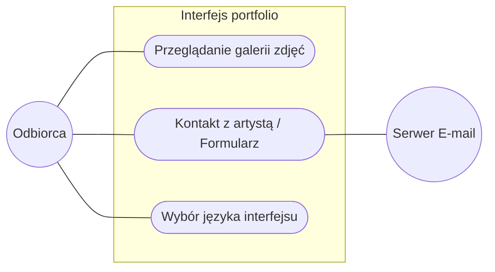

# Przypadki użycia Portfolio Artysty

## Specyfikacja przypadków użycia

<!-- PU1 -->
| **Nazwa** | Przeglądanie galerii zdjęć | 
| :--- | :--- |
| **Warunki wstępne** | Artysta udostępnił publicznie swoje portfolio w systemie ArtSea, w którym znajduje się co najmniej jedna praca graficzna. |
| **Podstawowy scenariusz interakcji** | 1. Odbiorca wchodzi na stronę galerii artysty. 2. System ładuje układ strony i wyświetla miniatury prac. 3. Odbiorca wybiera (klika) interesującą go miniaturę.  4. System wyświetla powiększone zdjęcie w wysokiej rozdzielczości wraz tytułem, opisem, użytymi technikami itd.  5. Odbiorca zamyka podgląd powiększonego zdjęcia.  6. System powraca do widoku głównej galerii, zachowując pozycję przewijania.|
| **Wyjątki i scenariusze alternatywne** | **Filtrowanie po kategorii:** 3a1. Odbiorca przed kliknięciem wybiera z menu konkretną kategorię prac (np. rzeźba) 3a2.System odświeża siatkę, pokazując wyłącznie miniatury z wybranej kategorii.    **Brak Prac:**  2a. Portfolio jest puste. System wyświetla wiadomość typu: "Artysta nie dodał jeszcze żadnych prac. Zajrzyj tu wkrótce!" |
| **Warunki końcowe** | Odbiorca pomyślnie obejrzał wybrane prace w portfolio. |
| **Komentarze** | idk w końcu jak robimy z tymi podstronami |
  

<!-- PU2 -->
| **Nazwa** | Kontakt z artystą / Formularz |
| :--- | :--- |
| **Warunki wstępne** | Odbiorca znajduje się w portfolio artysty. Artysta włączył opcję formularza kontaktowego w ustawieniach systemu. |
| **Podstawowy scenariusz interakcji** | 1. Odbiorca przechodzi do sekcji kontaktowej na stronie 2. System wyświetla formularz kontaktowy z polami: Imię i Nazwisko, Adres e-mail (zwrotny), Temat, Treść wiadomości. 3. Odbiorca wypełnia wszystkie wymagane pola.  4.  Odbiorca klika przycisk "Wyślij wiadomość".  5. System waliduje poprawność wprowadzonych danych.   6. System przekazuje wiadomość do zewnętrznego serwera E-mail  7. System wyświetla komunikat o sukcesie i czyści Formularz.|
| **Wyjątki i scenariusze alternatywne** | **Zachowanie stanu przy utracie sesji:** 3a. Jeśli Odbiorca na chwilę straci połączenie z internetem w trakcie pisania, system zachowuje wpisaną treść w pamięci lokalnej przeglądarki, zapobiegając utracie tekstu.   **Błąd walidacji danych:** 5a. Odbiorca wprowadził niepoprawny format adresu e-mail (np. brak znaku @) lub zostawił puste pole obowiązkowe. System nie wysyła wiadomości, podświetla błędne pola na czerwono i wyświetla komunikat: "Popraw błędy w formularzu przed wysłaniem".  **Błąd serwera:**  6a. Serwer napotyka błąd podczas próby wysłania wiadomości (np. problem z usługą e-mail). System wyświetla komunikat: "Wystąpił problem techniczny. Nie udało się wysłać wiadomości. Spróbuj ponownie później." Tekst wpisany przez użytkownika nie jest usuwany.
| **Warunki końcowe** | Wiadomość od Odbiorcy zostaje pomyślnie przekazana do wysyłki na adres e-mail Artysty. |
| **Komentarze** | --- |
  

<!-- PU3 -->
| **Nazwa** | Wybór języka interfejsu |
| :--- | :--- |
| **Warunki wstępne** | Odbiorca znajduje się w portfolio. System ma zaimplementowaną obsługę więcej niż jednego języka. |
| **Podstawowy scenariusz interakcji** | 1. Odbiorca lokalizuje przycisk wyboru języka. 2. Odbiorca klika przycisk wyboru języka. 3. System wyświetla listę dostępnych języków.  4. Odbiorca klika preferowany język.  5. System przeładowuje stronę na wybrany język. |
| **Wyjątki i scenariusze alternatywne** | **Brak tłumaczeń treści autorskich:** 5a. Interfejs platformy zmienia się na wybrany język, ale opisy zdjęć i biogram wprowadzone manualnie przez artystę pozostają w języku oryginalnym. System może opcjonalnie wyświetlić komunikat "Treści autorskie mogą nie być dostępne w wybranym języku".|
| **Warunki końcowe** | System zapamiętuje wybór języka w pliku cookie/localStorage na urządzeniu Odbiorcy na czas trwania sesji i kolejnych wizyt. Interfejs prezentowany jest w wybranym języku. |
| **Komentarze** | Czy tłumaczenie wprowadza artysta czy będzie automatyczne? |